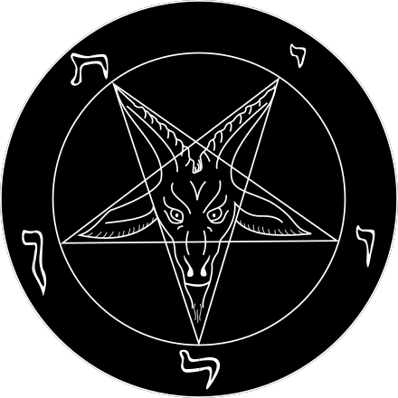

  

## _sys://transmission_of_666_

---

I'm known as **Kinderfeld** or **Dissenter**: software developer and cybersecurity expert who enjoys building stable, clean and functional software that respects user's freedom.
Founded  back in 2022.

Passionate about minimalism, privacy, UNIX-like operating systems, and software freedom.

---

## _sys://tech_stack_

| **Category** | **Tools** |
|-------------|-----------|
| **OS** |            |
| **Languages** |      |
| **Utilities** |        |
| **Virtualization**|   |

## _sys://featured_projects_

| Project | Description |
|---------|-------------|
| Archetypum [tum-bash](https://github.com/Archetypum/tum-bash) | A modular Bash library designed for building easy-to-read crossplatform scripts for UNIX-like systems. |
| Archetypum [tum-perl](https://github.com/Archetypum/tum-perl) | A modular Perl library designed for building easy-to-read crossplatform scripts for UNIX-like systems. |
| Archetypum [theSuffocater](https://github.com/Archetypum/theSuffocater) | A security-focused toolset aimed at hardening UNIX-like systems. |

  

